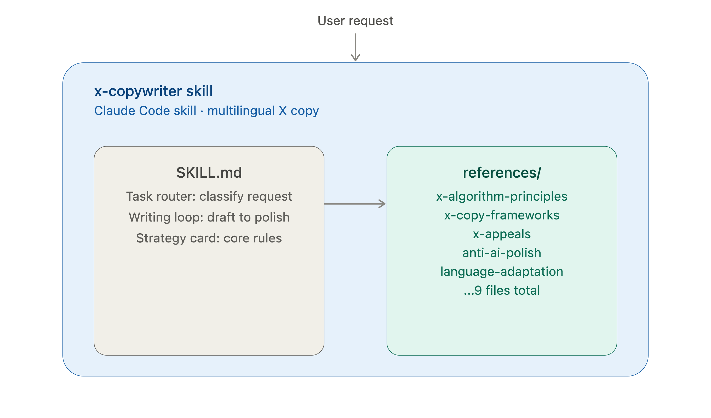
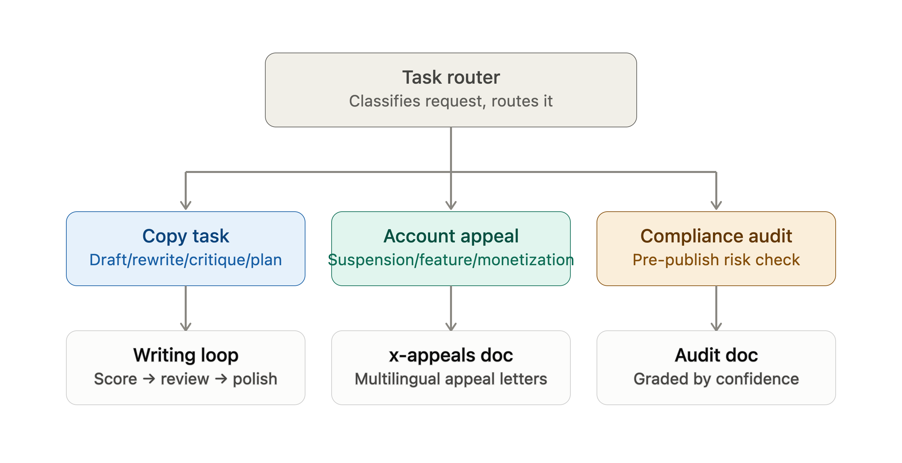
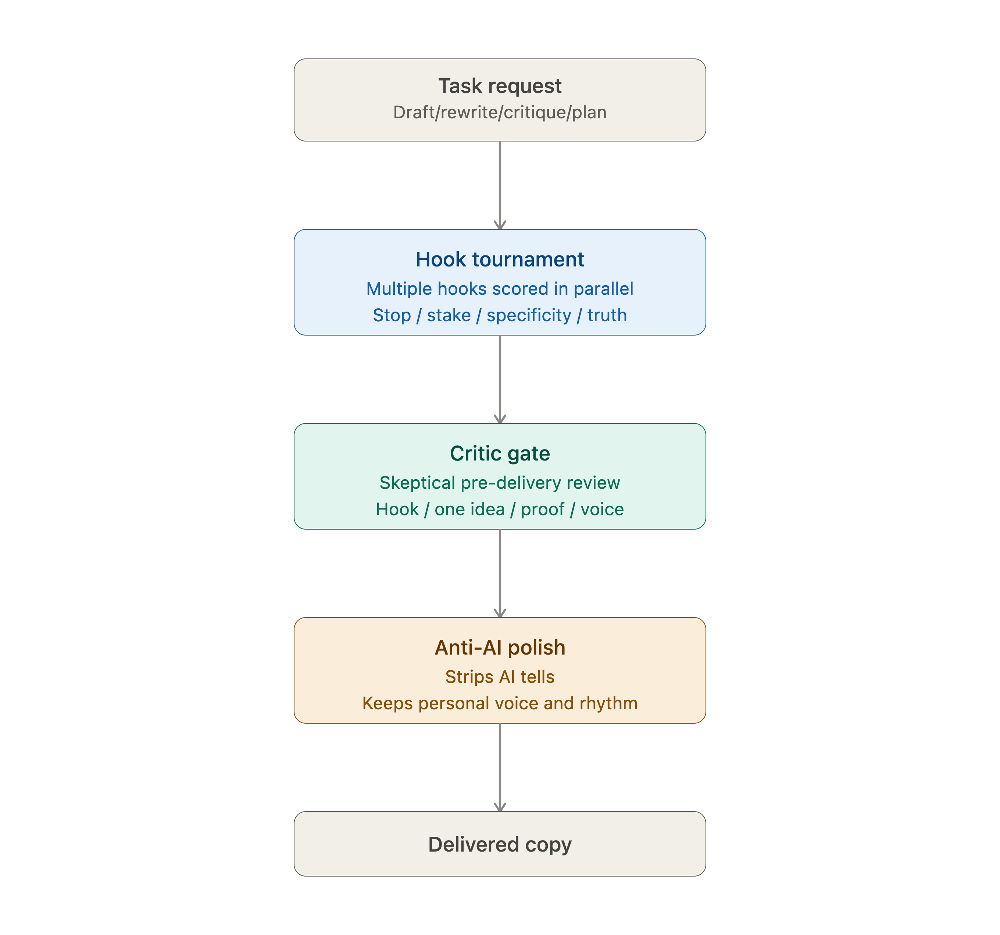

<div align="center">

# 🖋️ X Copywriter

[中文说明](README.md)

**An original, multilingual X/Twitter copywriting skill — AI copy that doesn't read like AI copy**

*10 reference docs · copy / appeals / compliance-audit routing · language-neutral by design*

[](LICENSE)
[](https://claude.com/claude-code)
[](references/language-adaptation.md)
[](references/x-appeals.md)

[](https://github.com/DengShiyingA/x-copywriter-skill/stargazers)
[](https://github.com/DengShiyingA/x-copywriter-skill/commits/main)
[](https://github.com/DengShiyingA/x-copywriter-skill/issues)

[](#what-makes-it-different)

</div>

---

**Ask ChatGPT for a tweet and it hands you "In today's fast-paced world"?
Ask an AI to draft an appeal and it invents "recent travel disrupted my network"?
Ask a generic model for copy and it can't stop saying "unlock," "game-changing," "seamless"?**

General-purpose models never learned X's actual writing physics — their training data has no hook tournament, no critic gate, and no respect for the negative-feedback signals that get a post reported or muted. This skill compresses marketing psychology, a writer-facing read of X's public algorithm, anti-AI-tone editing, and appeal-drafting discipline into one routable copy / appeals / compliance system, in any language, with no privileged pair.

**One `SKILL.md` plus 10 reference docs, routed automatically to the right output contract.** Once installed, the AI drafts like a writer who actually reads X's ranking signals, knows appeal evidence discipline, and never mistakes "let's dive in" for an opening line.

| | Generic AI | This skill |
|---|---|---|
| Tweet opener | "In today's fast-paced world, founders need..." | "Most founders don't have a customer interview problem. They have a synthesis problem." |
| Suspension appeal | "Recent travel and network changes may have triggered this restriction..." | States only verified facts, labels beliefs as uncertainty, never invents an excuse |
| Chinese copy | "在当今快速发展的时代,我们致力于赋能创作者,打造增长闭环" | "大家都在发日更,真正的问题是:你想让读者记住你什么?" |
| Compliance check | "Looks fine, should be safe to post!" | States exactly what was and wasn't reviewed, grades each finding by confidence |

> [!TIP]
> Every draft passes a skeptical **critic gate** (hook, one idea, proof, action fit, voice) before delivery — weak dimensions get rewritten, not shipped with a caveat.

> [!WARNING]
> The appeals workflow will **refuse** circulating templates that instruct fabricating an excuse (e.g. "recent travel / network change") or performing manufactured sincerity — see [x-appeals.md](references/x-appeals.md).

<div align="center">

🚀 [Installation](#installation) · ✍️ [What makes it different](#what-makes-it-different) · 🗂️ [Structure](#structure) · ⚖️ [Appeals & compliance](references/x-appeals.md)

</div>



## What makes it different

- **Writes for the right action, not just "engagement."** Maps copy to the actions X actually rewards (reply, quote, profile-click-then-stay) and away from the ones it taxes (mute, block, report).
- **Hook tournament.** Drafts several hooks across distinct mechanisms, scores them on stop / stake / specificity / truth, and ships the strongest — never the first catchy-but-vague line.
- **Critic gate.** Every draft passes a skeptical pre-delivery review (hook, one idea, proof, action fit, voice); weak dimensions are rewritten before you see the copy.
- **Topic scoring and A/B variants.** For higher-stakes work, it scores topic candidates, tests two distinct angles, critiques both, and selects the stronger final.
- **Voice fingerprint.** Matches your real voice from samples instead of flattening everything into generic founder-speak.
- **Anti-AI polish tuned for X.** Inverts long-form humanizer rules — keeps fragments and punchy one-liners, drops article-style scaffolding, and holds near-zero tolerance for AI tells in 280 characters.
- **Genuinely language-neutral.** Output matches the user's language by default. Chinese and English appear as worked examples of a universal method, not a privileged pair.
- **Evidence discipline.** Never fabricates numbers, testimonials, logos, stories, or platform rules — and never fabricates a reason for an enforcement action either.
- **X appeals with factual continuity.** Drafts account, post, feature, and monetization review requests in any requested language while checking prior submissions for contradictions and unsupported claims. Refuses circulating "appeal templates" that instruct fabricating an excuse or performing manufactured sincerity.
- **Pre-enforcement compliance self-audit.** Checks an account or draft posts against X's actual policies before anything is flagged — states what was and wasn't reviewed, grades each finding by confidence instead of guessing, and never recommends evading detection.
- **Long-form writing (X Articles).** The short-form anti-AI rules (near-zero tolerance, no headers) are inverted here — a dedicated section structure and its own long-form polish pass, not the short-form rules stretched thin.
- **Session variety enforcement.** Tracks which hook mechanisms and post shapes have already been used in this conversation and forces a rotation after two repeats, so the skill doesn't settle into its own recognizable formula.

### Task routing

Every request is classified first, then routed to one of three tracks — copywriting, appeals, or compliance self-audit — each with its own reference doc:



### Writing loop

Copywriting requests run through a gated pipeline — hook tournament, then a critic gate, then the anti-AI polish pass — before anything is delivered:



## Structure

<details>
<summary>Click to expand the file tree (10 reference docs)</summary>

```
SKILL.md                          # entry point: rules, task router, strategy card, writing loop, output contracts
references/
  x-algorithm-principles.md       # writer-facing read of the public X ranking pipeline
  x-copy-frameworks.md            # hooks, awareness calibration, voice fingerprint, threads, offers, critic gate
  hot-repo-patterns.md            # writing/workflow patterns to borrow from popular projects
  x-open-source-ecosystem.md      # X tooling, data access, and automation safety limits
  topic-scoring-and-variants.md   # topic scoring, A/B tests, critic scores, optional JSON output
  x-appeals.md                    # X enforcement and eligibility appeals, multilingual, plus pre-enforcement compliance self-audit
  long-form-writing.md            # X Articles: section structure, dedicated long-form anti-AI pass
  anti-ai-polish.md               # final-pass humanization, multilingual
  language-adaptation.md          # writing/adapting across languages
  examples.md                     # calibrated examples, including the internal tournament + critic-gate flow
agents/claude.yaml                # interface metadata
```

</details>

## Installation

This is a [Claude Code](https://claude.com/claude-code) agent skill. Install it by cloning the repo into a skills directory, using the **skill name** (`x-copywriter`) as the folder name.

**Personal (available in every project):**

```bash
git clone https://github.com/DengShiyingA/x-copywriter-skill.git ~/.claude/skills/x-copywriter
```

**Project-scoped (checked in with one repo):**

```bash
git clone https://github.com/DengShiyingA/x-copywriter-skill.git .claude/skills/x-copywriter
```

To update later:

```bash
git -C ~/.claude/skills/x-copywriter pull
```

Claude Code auto-discovers any directory under a skills path that contains a `SKILL.md`, so no further configuration is needed. Verify it loaded by running `/help` (it should appear in the skills list) or just by asking for X copy.

## Using it

Once installed, invoke it by asking for X/Twitter copy — drafting, rewriting, threads, launches, content plans, audits, or anti-AI polish, in any language. The skill triggers on requests like "write an X thread", "rewrite this tweet", "推文改写", or "founder launch post". It also triggers on account-health requests like "help me appeal this suspension", "review my monetization rejection", "账号申诉", or "check if my recent posts put my account at risk".

## On the algorithm references

The algorithm notes are a *writer-facing interpretation* of public open-source material (e.g. `xai-org/x-algorithm`, the older `twitter/the-algorithm-ml` weights, and Community Notes ranking). They improve audience fit, first-line clarity, and negative-feedback avoidance. They are **not** a reach guarantee — production ranking is retuned and not fully published, so the skill treats signal *ordering* as durable guidance, never as deterministic outcomes.

## License

[MIT](LICENSE).
