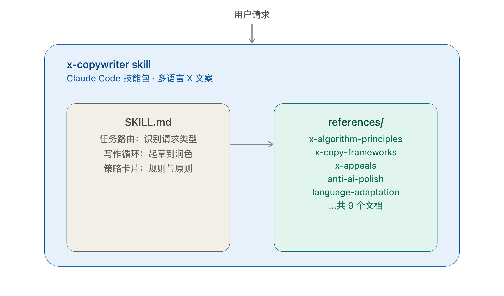
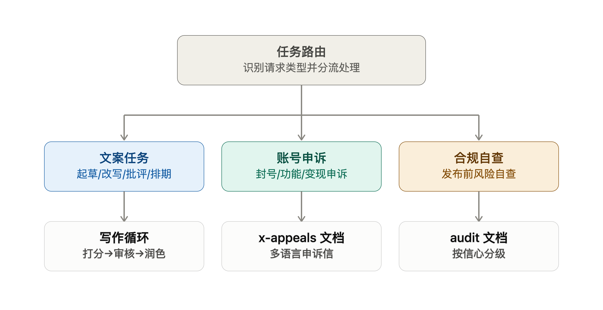
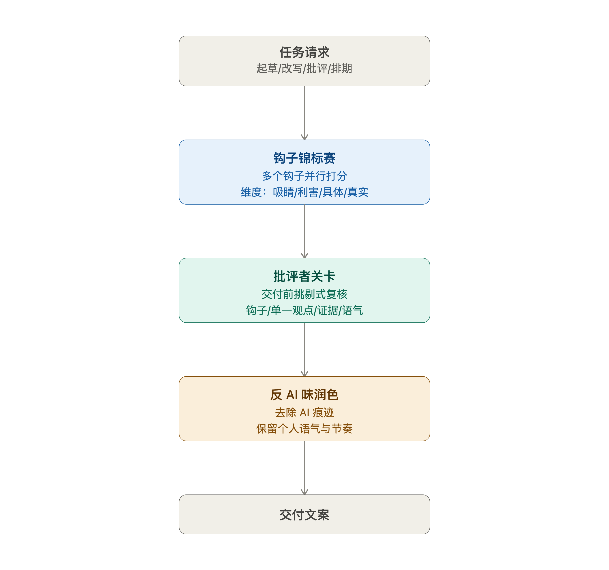

<div align="center">

# 🖋️ X Copywriter

[English README](README.en.md)

**原创多语言 X/Twitter 文案技能 · 让 AI 写出不像 AI 写的推文**

*9 份参考文档 · 文案 / 申诉 / 合规自查三线路由 · 语言中立,中英只是示例*

[](LICENSE)
[](https://claude.com/claude-code)
[](references/language-adaptation.md)
[](references/x-appeals.md)

[](https://github.com/DengShiyingA/x-copywriter-skill/stargazers)
[](https://github.com/DengShiyingA/x-copywriter-skill/commits/main)
[](https://github.com/DengShiyingA/x-copywriter-skill/issues)

[](#有什么不一样)

</div>

---

**问 ChatGPT 写条推文,它给你一段"在当今快节奏的时代"?
让某个 AI 写申诉信,它编了个"最近出差网络环境变化"的借口?
问随便哪个通用模型写中文文案,它满嘴"赋能""闭环""抓手""认知升级"?**

通用大模型从来没系统学过 X 这个平台的写作规律——它们的训练数据里没有钩子锦标赛、没有 Critic Gate、也不懂什么会触发举报/拉黑这种负反馈信号。所以这个技能把营销心理学、X 公开算法解读、反AI味润色方法、申诉纪律,浓缩成一套可路由的写作 + 申诉 + 合规体系,覆盖任意语言,不偏向中英任何一边。

**一份 `SKILL.md` + 9 份参考文档,自动路由到三种任务契约。** 装上之后,AI 会像懂 X 算法、懂申诉证据纪律、懂"说人话"的写手一样交付草稿——而不是把 "in today's fast-paced world" 或"赋能增长"当成合格的开头。

| | 通用 AI | 这个技能 |
|---|---|---|
| 推文开头 | "在当今快速发展的时代,创作者需要..." | "大家都在发日更,真正的问题是:你想让读者记住你什么?" |
| 封号申诉 | "近期出差网络环境变化可能导致误判..." | 只陈述可验证事实,把猜测明确标为不确定,绝不编借口 |
| 中文文案 | "致力于赋能创作者,打造增长闭环,实现认知升级" | 直接、克制,不堆互联网黑话 |
| 合规自查 | "看起来还行,应该没问题!" | 先说明查了什么、没查什么,每条发现按置信度分级 |

> [!TIP]
> 每份草稿在交付前都会经过一次挑剔的**批评者关卡**(钩子/单一观点/证据/行动适配/语气)——打分低的维度会被重写,而不是带着已知短板交付。

> [!WARNING]
> 申诉工作流会**主动拒绝**流传的模板里教你编造借口(比如"最近出差网络变化")或表演真诚的部分——详见 [x-appeals.md](references/x-appeals.md)。

<div align="center">

🚀 [安装](#安装) · ✍️ [有什么不一样](#有什么不一样) · 🗂️ [结构](#结构) · ⚖️ [申诉与合规自查](references/x-appeals.md)

</div>



## 有什么不一样

- **为正确的行动而写,不只是为"互动"。** 把文案对应到 X 真正奖励的行为(回复、引用、点进主页并停留),而不是那些会被惩罚的行为(取关、拉黑、举报)。
- **钩子锦标赛。** 用不同机制起草多个开头,按吸睛/利害/具体/真实打分,只发布最强的一个——绝不是第一个"抓人但空洞"的句子。
- **批评者关卡。** 每份草稿在交付前都会经过一次挑剔的复核(钩子、单一观点、证据、行动适配、语气);打分低的维度会被重写,而不是带着已知短板交付。
- **话题打分和 A/B 变体。** 面对高风险的内容,会给候选话题打分、写两个不同角度的版本、互相批评、选出更强的一版。
- **语音指纹。** 从你提供的样本里提取真实语音,而不是把所有内容拉平成千篇一律的创始人腔调。
- **为 X 调校过的反AI味润色。** 反转长文润色工具的规则——保留片段感和有力的单句,去掉文章式的排版脚手架,在 280 字符里对 AI 味的容忍度接近零。
- **真正的语言中立。** 输出默认匹配用户的语言。中文和英文只是这套通用方法的示例语言,不是被优待的语言对。
- **证据纪律。** 从不编造数据、证言、客户案例、故事、平台规则——也从不为执法处置编造理由。
- **具备事实连贯性的 X 申诉。** 用任何要求的语言起草账号、内容、功能、变现复核申请,同时核对历史申诉是否存在矛盾或无依据的说法。会拒绝流传的"申诉模板"里教你编造借口或表演真诚的部分。
- **事前合规自查。** 在任何处置发生之前,依据 X 的实际规则检查账号或草稿——先说明查了什么、没查什么,每条发现按置信度分级而不是靠猜,且绝不建议规避检测。

### 任务路由

每个请求先被分类,再路由到三条轨道之一——文案创作、账号申诉、合规自查——每条轨道对应一份独立的参考文档:



### 写作循环

文案类请求会经过一套有关卡的流程——钩子锦标赛,然后是批评者关卡,再经过反AI味润色——才会交付:



## 结构

<details>
<summary>点击展开文件树(9 份参考文档)</summary>

```
SKILL.md                          # 入口文件:规则、任务路由、策略卡片、写作循环、输出契约
references/
  x-algorithm-principles.md       # 面向创作者的公开 X 排序算法解读
  x-copy-frameworks.md            # 钩子、认知阶段、语音指纹、长推、发布文案、批评者关卡
  hot-repo-patterns.md            # 从热门开源项目里借鉴的写作/工作流模式
  x-open-source-ecosystem.md      # X 工具生态、数据获取方式、自动化安全边界
  topic-scoring-and-variants.md   # 话题打分、A/B 测试、批评打分、可选的 JSON 输出
  x-appeals.md                    # X 执法与资格申诉(多语言),含事前合规自查
  anti-ai-polish.md               # 最终反AI味润色(多语言)
  language-adaptation.md          # 跨语言写作/适配
  examples.md                     # 校准用示例,含内部的锦标赛+批评关卡流程
agents/claude.yaml                # 接口元数据
```

</details>

## 安装

这是一个 [Claude Code](https://claude.com/claude-code) agent skill。把仓库克隆到一个 skills 目录下,文件夹名用**技能名**(`x-copywriter`)。

**个人级(所有项目里都可用):**

```bash
git clone https://github.com/DengShiyingA/x-copywriter-skill.git ~/.claude/skills/x-copywriter
```

**项目级(和某个仓库一起提交):**

```bash
git clone https://github.com/DengShiyingA/x-copywriter-skill.git .claude/skills/x-copywriter
```

以后更新:

```bash
git -C ~/.claude/skills/x-copywriter pull
```

Claude Code 会自动发现 skills 路径下任何包含 `SKILL.md` 的目录,不需要额外配置。可以跑一下 `/help`(应该会出现在技能列表里)或者直接要求写 X 文案来验证是否加载成功。

## 怎么用

安装后,直接要求 X/Twitter 文案即可触发——起草、改写、长推、发布、内容计划、审计、反AI味润色,任何语言都行。触发词比如 "write an X thread"、"rewrite this tweet"、"推文改写"、"founder launch post"。也会在账号健康相关的请求上触发,比如 "help me appeal this suspension"、"review my monetization rejection"、"账号申诉"、"check if my recent posts put my account at risk"。

## 关于算法参考资料

算法笔记是对公开开源材料(比如 `xai-org/x-algorithm`、更早的 `twitter/the-algorithm-ml` 权重、以及 Community Notes 排序)的**面向创作者的解读**。它们能提升受众匹配度、首句清晰度、负反馈规避能力,但**不是**触达量的保证——生产环境的排序会持续调整且未完全公开,所以这个技能把信号的*相对顺序*当作可靠依据,而不是当作确定性结果。

## License

[MIT](LICENSE)。
